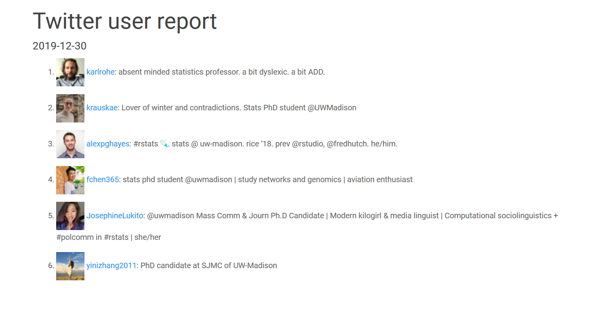

<!-- README.md is generated from README.Rmd. Please edit that file -->

# tweeple

<!-- badges: start -->

<!-- badges: end -->

`tweeple` helps you with exploratory data analysis by creating reports
on Twitter users.

## Installation

You can install the development version from
[GitHub](https://github.com/) with:

``` r
# install.packages("devtools")
devtools::install_github("alexpghayes/tweeple")
```

## How to generate a report

To create an HTML report on a set of Twitter users, use
`create_report()`. For example:

``` r
library(tweeple)

rohe_lab <- c(
  "karlrohe",  "krauskae", "alexpghayes", "fchen365",
   "JosephineLukito", "yinizhang2011"
)

create_report(
  rohe_lab,
  output_file = "rohe_lab_without_recent_tweets.html"
)
#> Generated report is available at "C:/Users/alex/Desktop/tweeple/rohe_lab_without_recent_tweets.html".
```

This results in a report that looks like the following:



You can also include recent tweets in the report to get a feel for the
type of content each user engages with with:

``` r
create_report(
  rohe_lab,
  recent_tweets = 3,
  output_file = "rohe_lab_with_recent_tweets.html"
)
#> Generated report is available at "C:/Users/alex/Desktop/tweeple/rohe_lab_with_recent_tweets.html".
```

This results in a report that looks like:


## These reports are ugly and I want to make them better

Please do\! Contributions are welcome.
